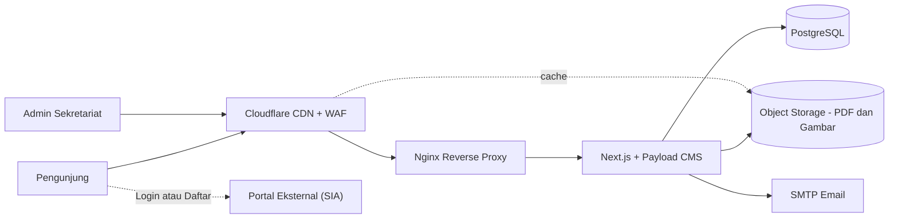
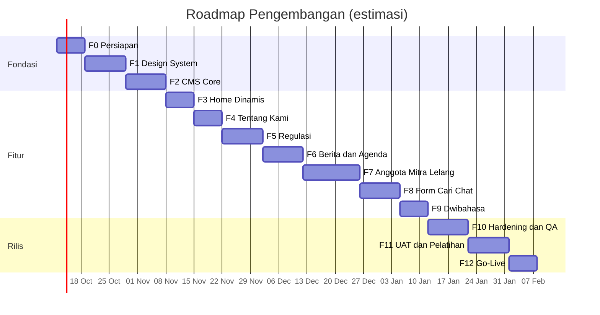

# PRD — Website Resmi DPP INKINDO DKI Jakarta

| Atribut | Keterangan |
|---|---|
| **Versi Dokumen** | 1.1 |
| **Tanggal** | 8 Oktober 2026 |
| **Status** | Draft – menunggu review (sebagian pertanyaan terbuka sudah terjawab) |
| **Basis Desain** | `index.html`, `css/style.css`, `js/script.js` (landing page statis saat ini) |
| **Pemilik Produk** | Sekretariat DPP INKINDO DKI Jakarta |

---

## 1. Ringkasan

Website saat ini masih berupa **landing page statis** (HTML + CSS + JS vanilla). Desain, gaya visual, dan struktur menunya sudah final dan jadi **acuan visual utama**.

Proyek lanjutan ini bertujuan untuk:

1. **Menjalankan semua menu dan fitur** yang ada di landing page (navbar, dropdown, side-nav, panel, search, carousel, berita, footer) supaya terhubung ke halaman dan data sungguhan.
2. **Membuat halaman-halaman baru** untuk setiap menu/informasi.
3. **Menyediakan CMS (Content Management System)** agar admin sekretariat yang **bukan orang IT** bisa mengelola semua konten sendiri.
4. Memastikan website **cepat, efisien, aman, dan sanggup diakses banyak orang sekaligus**.

> **Di luar cakupan:** Halaman **Login** dan **Register/Pendaftaran** tidak dibangun di proyek ini. Semua tombol login/daftar hanya **redirect ke portal eksternal**, dan URL tujuannya bisa diatur dari CMS.

---

## 2. Tujuan & Indikator Keberhasilan

| # | Tujuan | Indikator (KPI) |
|---|---|---|
| G1 | Semua menu berfungsi | 0 link `href="#"` mati saat go-live |
| G2 | Admin non-IT mandiri | Admin bisa membuat berita, mengunggah regulasi, dan mengganti banner **tanpa bantuan developer** setelah 1 sesi pelatihan |
| G3 | Cepat | Lighthouse Performance ≥ 90 (mobile), LCP < 2,5 dtk, CLS < 0,1, INP < 200 ms |
| G4 | Skalabel | Mampu melayani ≥ 1.000 pengguna bersamaan dengan p95 response < 500 ms (halaman ter-cache) |
| G5 | Aman | Lolos checklist OWASP Top 10, skor A di securityheaders.com & SSL Labs |
| G6 | Mudah ditemukan | SEO score Lighthouse ≥ 95, sitemap & metadata dinamis |
| G7 | Konsistensi desain | Tampilan halaman baru 100% mengikuti design system yang sudah ada |

---

## 3. Pengguna (Persona)

| Persona | Kebutuhan Utama |
|---|---|
| **Pengunjung umum / calon anggota** | Info profil, cara jadi anggota, berita, kontak |
| **Anggota INKINDO** | Regulasi, info lelang, agenda pelatihan, perpanjangan anggota, klinik konsultasi |
| **Mitra kerja / calon mitra** | Ketentuan kemitraan, daftar mitra |
| **Instansi pemerintah / pengguna jasa** | Cek direktori anggota terdaftar dan terverifikasi |
| **Admin Sekretariat (non-IT)** | Mengelola konten lewat dasbor yang sederhana |
| **Super Admin / Developer** | Pengaturan sistem, user admin, backup |

---

## 4. Rekomendasi Arsitektur & Tech Stack

### 4.1 Pertimbangan Utama

- Website ini **sebagian besar dibaca (read-heavy)** dan jarang diubah. Strategi terbaik adalah **halaman pre-render + cache di CDN**, sehingga ribuan pengunjung tidak membebani server/database.
- CSS dan HTML yang ada harus **bisa dipindahkan langsung** tanpa menulis ulang desain.
- CMS harus **ramah pengguna awam**, open-source (tanpa biaya lisensi), dan bisa di-*self-host* (data tetap milik INKINDO).
- Satu bahasa pemrograman (TypeScript) dari ujung ke ujung supaya mudah dirawat tim kecil/magang.

### 4.2 Stack Terpilih

| Lapisan | Teknologi | Alasan |
|---|---|---|
| **Frontend** | **Next.js (App Router) + TypeScript** | Mendukung SSG/ISR (halaman statis yang otomatis diperbarui), SEO bagus, optimasi gambar bawaan. CSS vanilla yang ada bisa dipakai langsung sebagai global CSS / CSS Modules |
| **Styling** | **Vanilla CSS** (port dari `style.css`) + CSS Variables | Mempertahankan desain 100%, tanpa framework CSS tambahan |
| **CMS + Backend API** | **Payload CMS 3** (berjalan di dalam Next.js yang sama) | Open-source, admin panel modern dan mudah dipakai, ada draft/publish, versi konten, live preview, multi-bahasa, role-based access. Satu aplikasi = deploy lebih sederhana |
| **Database** | **PostgreSQL 16** | Stabil, cepat, mendukung full-text search, relasi data kuat |
| **Penyimpanan Media** | **Object Storage S3-compatible** (Cloudflare R2 / IDCloudHost Object Storage) | File PDF regulasi & gambar tidak membebani server, murah, bisa lewat CDN |
| **CDN + WAF + DNS** | **Cloudflare** | Cache global, proteksi DDoS, WAF, SSL gratis, Turnstile (captcha) |
| **Pencarian** | PostgreSQL Full-Text Search (fase awal), opsional **Meilisearch** jika data sudah besar | Hemat infrastruktur di awal, bisa di-upgrade |
| **Email** | SMTP transactional (Brevo / Mailgun / SMTP domain inkindo) | Notifikasi form Klinik & Hubungi Kami |
| **Hosting** | **VPS Indonesia** (mis. Biznet Gio / IDCloudHost, 2 vCPU / 4 GB RAM) + **Docker Compose** + **Nginx** | Latensi rendah untuk pengguna Indonesia, biaya terkontrol, data di dalam negeri (sesuai UU PDP) |
| **CI/CD** | GitHub Actions | Lint, test, build, dan deploy otomatis |
| **Monitoring** | Uptime Kuma / BetterStack, Sentry (error), Cloudflare Analytics / Umami | Pantau uptime, error, dan trafik tanpa cookie pihak ketiga |

### 4.3 Alternatif yang Dipertimbangkan

| Opsi | Kelebihan | Kekurangan | Keputusan |
|---|---|---|---|
| Next.js + Payload + PostgreSQL | 1 codebase, TypeScript penuh, CMS ramah | Butuh server Node.js | ✅ **Dipilih** |
| Astro + Strapi + PostgreSQL | Astro sangat ringan | 2 aplikasi terpisah, deploy & maintenance lebih rumit | Cadangan |
| Laravel + Filament + MySQL | Ekosistem PHP familiar, hosting murah | Frontend interaktif kurang optimal, SSG/ISR tidak native | Cadangan jika tim lebih paham PHP |
| WordPress | Admin sangat dikenal | Rawan celah plugin, performa butuh banyak tuning, desain custom lebih sulit | ❌ |

### 4.4 Diagram Arsitektur



### 4.5 Strategi Rendering & Cache

| Jenis Halaman | Strategi | Keterangan |
|---|---|---|
| Home, Profil, Struktur, Ketentuan | **SSG + On-demand Revalidation** | Halaman dibuat statis. Saat admin klik "Publish", halaman terkait otomatis diperbarui |
| Daftar & detail Berita/Regulasi | **ISR** + revalidate saat publish | Halaman detail dibuat saat pertama diakses lalu di-cache |
| Direktori Anggota (search/filter) | **Server-side + cache 5 menit** | Query dibatasi & dipaginasi |
| Form (Klinik, Kontak) | **Server Action / API** | Rate-limit + captcha |
| Admin panel `/admin` | Dinamis, **tidak di-cache** | Dilindungi tambahan (lihat Keamanan) |

---

## 5. Peta Situs (Sitemap) & Halaman

Semua halaman memakai **header, side-nav, panel geser, dan footer** yang sama dengan landing page.

```
/                                   Home (landing page dinamis)
├── /tentang-kami
│   ├── /profil                     Profil INKINDO (sejarah, visi-misi, nilai)
│   └── /struktur-organisasi        Tab: DPP (DPPH, DPPL, Badan-badan, Komite), DKP, DPOP, Setprov
├── /regulasi
│   ├── /inkindo                    Regulasi internal INKINDO (AD/ART, Pedoman, SK)
│   ├── /jasa-konsultasi            Filter: Konstruksi | Non Konstruksi | Umum
│   ├── /terkait                    Regulasi terkait (Perpres, Permen, dsb.)
│   └── /[slug]                     Detail dokumen + preview PDF + unduh
├── /berita                         Daftar berita (filter kategori, cari, paginasi)
│   ├── /[slug]                     Detail berita
│   ├── /agenda                     Daftar agenda/event (mendatang & selesai)
│   └── /e-magazine                 Arsip majalah digital (flipbook/PDF)
├── /info-lelang
│   ├── /lkpp                       Info & tautan resmi LKPP/INAPROC
│   └── /lainnya                    Info lelang lain (dikelola CMS)
├── /anggota
│   ├── /pendaftaran                Syarat, alur, biaya → tombol redirect ke portal eksternal
│   ├── /perpanjangan               Syarat, jadwal herregistrasi → redirect ke portal eksternal
│   └── /terdaftar                  Direktori anggota (cari nama, filter bidang/status)
├── /mitra-kerja
│   ├── /ketentuan                  Syarat & panduan kemitraan
│   └── /daftar                     Katalog mitra + logo + detail
├── /klinik-konsultasi              Info layanan + form pengajuan konsultasi
├── /hubungi-kami                   Kontak, peta lokasi, form pesan
├── /cari?q=                        Hasil pencarian global
├── /kebijakan-privasi
├── /syarat-layanan
└── /404, /500                      Halaman error bergaya sama
```

### 5.1 Pemetaan Elemen Landing Page → Fungsi

| Elemen saat ini | Fungsi setelah dikembangkan |
|---|---|
| Navbar "Tentang Kami" & "Regulasi" (dropdown klik) | Link ke halaman masing-masing |
| Navbar "Berita & Informasi" | `/berita` |
| Ikon search header & hero search (efek ketik) | Ke `/cari?q=...`. Teks efek ketik bisa diatur dari CMS |
| Toggle bahasa ID / EN | Ganti locale (`/en/...`), konten EN diisi dari CMS |
| Side-nav **Login** (3 opsi) | Redirect ke URL eksternal (diatur di CMS) |
| Side-nav **Info Lelang** | Link ke `/info-lelang/lkpp` & `/info-lelang/lainnya` |
| Side-nav **Anggota** | Pendaftaran & Perpanjangan → halaman info + CTA eksternal; Terdaftar → direktori |
| Side-nav **Mitra Kerja** | Ketentuan, Daftar, dan grid logo mitra dari CMS |
| Side-nav **Klinik Konsultasi** | Topik dari CMS, tombol → form `/klinik-konsultasi` |
| Side-nav **Hubungi Kami** | Data kontak dari CMS (Global Settings) |
| Side-nav **Chat** | Chatbot FAQ (jawaban dari CMS) + tombol lanjut ke WhatsApp admin |
| Carousel hero | Banner dari CMS (gambar, judul, intro, link, urutan, jadwal tayang) |
| Marquee "Mitra Kerja" | Logo mitra dari CMS (flag "tampil di beranda") |
| Ticker statistik | Statistik dari CMS (jumlah anggota bisa otomatis dihitung dari data) |
| Bento Berita | 3 konten terbaru/pilihan (flag "unggulan") |
| Footer (akses cepat, kontak, sosial, kebijakan) | Semua dari CMS (Global Footer) |

---

## 6. Kebutuhan Fungsional

### 6.1 Website Publik

| ID | Fitur | Prioritas | Deskripsi |
|---|---|---|---|
| F-01 | Layout global | P0 | Header, dropdown, side-nav, side-panel, footer sebagai komponen reusable |
| F-02 | Home dinamis | P0 | Semua section landing page mengambil data dari CMS |
| F-03 | Profil | P0 | Rich content (teks, gambar, visi-misi) |
| F-04 | Struktur organisasi | P0 | Tab per badan, kartu pengurus (foto, nama, jabatan), urutan bisa diatur |
| F-05 | Pustaka regulasi | P0 | Daftar dokumen, filter kategori/sub-kategori/tahun, cari, preview PDF, unduh, hitung jumlah unduhan |
| F-06 | Berita & informasi | P0 | Daftar + detail, kategori, tag, share sosial media, berita terkait |
| F-07 | Agenda | P1 | Tanggal mulai/selesai, lokasi/daring, link pendaftaran eksternal, status otomatis (mendatang/berlangsung/selesai) |
| F-08 | e-Magazine | P1 | Arsip edisi, cover, baca PDF di browser |
| F-09 | Info lelang | P1 | LKPP (konten + tautan resmi), Lainnya (daftar info: judul, instansi, nilai, batas waktu, sumber) dengan status kedaluwarsa otomatis |
| F-10 | Anggota – Pendaftaran & Perpanjangan | P0 | Halaman info (syarat, alur, biaya, FAQ) + CTA redirect eksternal |
| F-11 | Direktori anggota terdaftar | P0 | Cari nama/NPA, filter bidang & status, paginasi, **hanya menampilkan data publik** |
| F-12 | Mitra kerja | P1 | Ketentuan + katalog mitra (logo, nama, kategori, website) |
| F-13 | Klinik konsultasi | P1 | Form (nama, perusahaan, email, telp, topik, pertanyaan) → tersimpan di CMS + email notifikasi |
| F-14 | Hubungi kami | P0 | Info kontak, Google Maps embed, form pesan |
| F-15 | Pencarian global | P1 | Cari di berita, regulasi, agenda, halaman. Hasil dikelompokkan per tipe |
| F-16 | Chatbot FAQ | P2 | Jawaban dari koleksi FAQ (pencocokan kata kunci), fallback ke WhatsApp/email |
| F-17 | Dwibahasa ID/EN | P2 | Localization per field di CMS, fallback ke ID jika EN kosong |
| F-18 | SEO | P0 | Meta title/description per halaman (bisa diubah di CMS), Open Graph, `sitemap.xml`, `robots.txt`, structured data (Organization, NewsArticle, Event) |
| F-19 | Aksesibilitas | P1 | WCAG 2.1 AA: kontras, navigasi keyboard, alt text wajib di CMS |
| F-20 | Redirect eksternal | P0 | Semua URL login/daftar/portal diatur dari CMS Global "Tautan Eksternal" |

### 6.2 CMS (Panel Admin)

| ID | Fitur | Prioritas | Deskripsi |
|---|---|---|---|
| C-01 | Login admin aman | P0 | Email + password kuat + **2FA (TOTP)**, khusus admin CMS (bukan login anggota) |
| C-02 | Peran & hak akses | P0 | **Super Admin** (semua), **Editor** (publish semua konten), **Kontributor** (buat draft saja, perlu persetujuan) |
| C-03 | Editor visual | P0 | Rich text editor (seperti Word): heading, bold, list, gambar, tabel, embed video |
| C-04 | Draft → Review → Publish | P0 | Status konten + jadwal publish otomatis |
| C-05 | Riwayat versi | P1 | Lihat dan kembalikan versi sebelumnya |
| C-06 | Live preview | P1 | Lihat tampilan sebelum publish |
| C-07 | Media library | P0 | Upload drag & drop, crop, auto resize + konversi WebP/AVIF, validasi tipe & ukuran |
| C-08 | Pengaturan global | P0 | Kontak, sosial media, footer, tautan eksternal, teks hero search, statistik |
| C-09 | Urutan drag & drop | P1 | Banner, pengurus, logo mitra, menu |
| C-10 | Inbox form | P1 | Lihat pesan Klinik/Kontak, tandai status (baru/diproses/selesai), export CSV |
| C-11 | Import data massal | P1 | Import anggota/mitra dari Excel/CSV |
| C-12 | Audit log | P1 | Catat siapa mengubah apa dan kapan |
| C-13 | Bantuan inline | P1 | Deskripsi/tooltip di setiap field dalam Bahasa Indonesia, mis. "Ukuran gambar ideal 1600×900" |
| C-14 | Dashboard ringkas | P2 | Jumlah konten, pesan baru, dokumen paling sering diunduh |

> **Prinsip UX CMS untuk non-IT:** label dan menu dalam Bahasa Indonesia, field wajib diberi tanda jelas, tidak ada istilah teknis, validasi langsung dengan pesan yang mudah dipahami, dan tersedia **panduan PDF + video singkat** untuk admin.

---

## 7. Model Data (Koleksi CMS)

| Koleksi / Global | Field utama |
|---|---|
| `users` (admin CMS) | nama, email, role, 2FA, status aktif |
| `media` | file, alt (wajib), caption, ukuran otomatis |
| `pages` | judul, slug, blok konten (layout builder), SEO |
| `banners` | gambar, intro, judul, link, urutan, mulai_tayang, akhir_tayang, aktif |
| `posts` (berita) | judul, slug, ringkasan, cover, konten, kategori, tag, unggulan, tanggal_publish, penulis, SEO |
| `categories` | nama, slug, tipe (berita/agenda) |
| `events` (agenda) | judul, cover, deskripsi, tgl_mulai, tgl_selesai, lokasi, mode (luring/daring/hybrid), link_daftar |
| `magazines` | edisi, judul, cover, file_pdf, tanggal_terbit |
| `regulations` | judul, nomor, tahun, kategori (Inkindo/Jasa Konsultasi/Terkait), sub_kategori (Konstruksi/Non Konstruksi/Umum), file_pdf, ringkasan, status_berlaku, jumlah_unduh |
| `org_units` | nama badan (DPPH, DPPL, Badan, Komite, DKP, DPOP, Setprov), induk, urutan |
| `org_members` | nama, foto, jabatan, unit (relasi), periode, urutan |
| `members` (anggota) | nama_perusahaan, NPA, bidang/subklasifikasi, kota, status (aktif/nonaktif), berlaku_sampai, website — *hanya data publik* |
| `partners` (mitra) | nama, logo, kategori, website, deskripsi, tampil_di_beranda, urutan |
| `tenders` (info lelang) | judul, instansi, sumber (LKPP/lainnya), nilai_HPS, batas_waktu, link_sumber |
| `faqs` | pertanyaan, jawaban, kata_kunci, kategori |
| `consultation_requests` | data form klinik + status + catatan admin |
| `contact_messages` | data form kontak + status |
| Global `site-settings` | logo, kontak, jam operasional, sosial media, alamat, peta |
| Global `external-links` | URL login anggota, mitra, admin, pendaftaran, perpanjangan, SIA |
| Global `homepage` | teks efek ketik hero, statistik ticker, pilihan berita unggulan |
| Global `navigation` / `footer` | menu & link footer |

> [!NOTE]
> Data **anggota terdaftar** bisa diisi lewat import CSV dari CMS, atau (jika portal eksternal menyediakan API) disinkronkan otomatis terjadwal. Keputusan ini termasuk **pertanyaan terbuka** (lihat bagian 13).

### 7.1 Nilai Awal Global `external-links` (Terkonfirmasi)

| Field | URL | Dipakai di |
|---|---|---|
| `login_anggota` | `https://www.inkindo-dki.org/auth/login` | Side-panel Login → "Anggota INKINDO" |
| `pendaftaran_anggota` | `https://www.inkindo-dki.org/register` | Side-panel Anggota → "Pendaftaran Anggota" (CTA di `/anggota/pendaftaran`) |
| `login_mitra` | *belum ditentukan* | Side-panel Login → "Mitra Kerja" |
| `login_admin` | *belum ditentukan* | Side-panel Login → "Admin Kesekretariatan" |
| `perpanjangan_anggota` | *belum ditentukan* | Side-panel Anggota → "Perpanjangan Anggota" |

- Link eksternal dibuka di tab yang sama dengan atribut `rel="noopener"`.
- Selama URL masih kosong, tombol menampilkan status **"Segera Hadir"** (tidak boleh `href="#"`).

> [!IMPORTANT]
> Portal login/daftar berada di **domain yang sama** (`www.inkindo-dki.org`). Jika website baru juga akan memakai domain `www.inkindo-dki.org`, maka path **`/auth/*` dan `/register`** harus tetap diteruskan ke aplikasi portal yang lama lewat aturan reverse proxy (Nginx/Cloudflare). Next.js **tidak boleh** memiliki route dengan path tersebut. Lihat Risiko & Pertanyaan Terbuka.

---

## 8. Kebutuhan Non-Fungsional

### 8.1 Performa & Skalabilitas

- Semua halaman publik **di-cache di Cloudflare** (cache HTML + aset). Database hanya diakses saat cache kedaluwarsa atau konten diperbarui.
- Gambar otomatis dikompres (WebP/AVIF), responsif (`srcset`), lazy-load di bawah fold, dan ada placeholder blur.
- Font self-host melalui `next/font` (tanpa request ke Google saat runtime). Ikon Material Symbols di-subset agar tidak memuat seluruh font.
- JavaScript minimal: komponen interaktif (carousel, dropdown, panel, chat) saja yang jalan di client, sisanya Server Components.
- Index database pada kolom yang sering dicari (slug, kategori, tanggal, nama anggota) + full-text index.
- Paginasi wajib untuk semua daftar (maks. 24 item/halaman).
- Connection pooling PostgreSQL.
- **Budget performa:** JS awal < 150 KB gzip, total halaman Home < 1,5 MB.

### 8.2 Keamanan

| Area | Kontrol |
|---|---|
| Transport | HTTPS wajib, HSTS (preload), TLS 1.2+ |
| Header keamanan | CSP ketat, `X-Frame-Options: DENY`, `X-Content-Type-Options: nosniff`, `Referrer-Policy`, `Permissions-Policy` |
| Panel admin | Path `/admin` dilindungi tambahan (**Cloudflare Access** atau IP allowlist kantor), 2FA wajib, kunci akun setelah 5 kali gagal, session timeout 2 jam |
| Password | Hash bcrypt/argon2, minimal 12 karakter |
| Form publik | **Cloudflare Turnstile** (captcha), rate limit (mis. 5 request/menit/IP), honeypot, validasi skema (Zod) di server |
| Input & output | Sanitasi rich text (cegah XSS), query ORM berparameter (cegah SQL Injection), CSRF protection |
| Upload file | Whitelist MIME (PDF, JPG, PNG, WebP), batas ukuran (gambar 5 MB, PDF 20 MB), rename file acak, file tidak bisa dieksekusi |
| Infrastruktur | Firewall VPS (hanya port 80/443 dari Cloudflare + SSH via key), user DB least-privilege, Docker non-root, update OS otomatis |
| Secrets | Disimpan di `.env` / GitHub Secrets, tidak pernah di-commit |
| Dependensi | Dependabot + `npm audit` di CI, update berkala bulanan |
| WAF & DDoS | Cloudflare WAF managed rules + bot fight mode |
| Backup | `pg_dump` harian otomatis, retensi 30 hari, disimpan di lokasi terpisah + **uji restore bulanan**. Object storage pakai versioning |
| Logging | Log akses & error terpusat, audit log CMS, alert ke email/Telegram saat error tinggi atau down |
| Privasi | Patuh **UU No. 27/2022 (PDP)**: data form hanya untuk keperluan layanan, ada kebijakan privasi, data pribadi anggota non-publik tidak ditampilkan |

### 8.3 Lainnya

- **Kompatibilitas:** Chrome, Edge, Firefox, Safari (2 versi terakhir), Android & iOS.
- **Responsif:** 360 px s/d 1920 px+.
- **Ketersediaan:** target uptime 99,5%.
- **Maintainability:** TypeScript strict, ESLint + Prettier, struktur folder konsisten, README & dokumentasi deploy.

---

## 9. Struktur Proyek (Rencana)

```
inkindo-web/
├── src/
│   ├── app/
│   │   ├── (frontend)/            # Halaman publik
│   │   │   ├── [locale]/...       # Routing ID/EN
│   │   │   └── layout.tsx         # Header, SideNav, Footer
│   │   └── (payload)/admin/       # Panel CMS
│   ├── collections/               # Definisi koleksi Payload
│   ├── globals/                   # Site settings, footer, external links
│   ├── components/                # Header, Dropdown, SideNav, SidePanel, Carousel, Bento, Card, dll.
│   ├── styles/                    # Port dari css/style.css (tokens, base, components)
│   ├── lib/                       # Helper fetch data, SEO, validasi
│   └── hooks/                     # Revalidation hooks
├── public/                        # Aset statis (logo, favicon)
├── tests/                         # Unit, e2e (Playwright), load test (k6)
├── docker/                        # Dockerfile, nginx.conf, docker-compose.yml
└── docs/                          # Panduan admin, panduan deploy
```

---

## 10. Tahapan Pengembangan & Checkpoint

Setiap fase **wajib lolos checkpoint** sebelum lanjut ke fase berikutnya.

**Aturan gerbang checkpoint (Quality Gate):**
- ✅ Semua kriteria penerimaan terpenuhi
- ✅ **Tidak ada bug P0 (kritis) atau P1 (tinggi)** yang masih terbuka
- ✅ Build CI hijau (lint, type-check, test)
- ✅ Sudah di-deploy ke **staging** dan direview oleh pemilik produk

| Severity | Definisi | Contoh | Batas waktu perbaikan |
|---|---|---|---|
| **P0 – Kritis** | Situs down / celah keamanan / data hilang | Admin panel bisa diakses tanpa login | Segera (< 24 jam) |
| **P1 – Tinggi** | Fitur utama tidak berjalan | Unduh regulasi gagal | Sebelum checkpoint |
| **P2 – Sedang** | Fitur jalan tapi ada kekurangan | Filter tidak reset | Boleh dibawa ke fase berikutnya (dicatat) |
| **P3 – Rendah** | Kosmetik | Jarak antar elemen 2 px meleset | Backlog |

---

### Fase 0 — Persiapan & Fondasi (± 1 minggu)

**Tugas**
- [ ] Setup repository Git (branch `main`, `staging`, `feature/*`)
- [ ] Inisialisasi Next.js + TypeScript + Payload CMS + PostgreSQL (Docker Compose lokal)
- [ ] ESLint, Prettier, Husky (pre-commit), konvensi commit
- [ ] GitHub Actions: lint → type-check → build
- [ ] Server staging + domain staging (mis. `staging.inkindo-dki.org`)
- [ ] Project board untuk issue & bug tracking (GitHub Projects)

**✅ Checkpoint 0**
- [ ] `npm run dev` berjalan, `/admin` bisa dibuka
- [ ] Pipeline CI hijau
- [ ] Staging bisa diakses via HTTPS

---

### Fase 1 — Migrasi Design System & Layout (± 1,5 minggu)

**Tugas**
- [ ] Port `style.css` ke struktur `styles/` (design tokens, base, komponen)
- [ ] Ubah HTML menjadi komponen: `Header`, `NavDropdown` (klik buka/tutup), `SearchBar`, `LangSwitch`, `SideNav`, `SidePanel`, `Carousel`, `Ticker`, `Marquee`, `BentoNews`, `Footer`
- [ ] Port logika `script.js` ke komponen client (efek ketik, carousel, panel, scroll header, reveal animation)
- [ ] Template halaman generik: `PageHero`, `Breadcrumb`, `ContentLayout`, `Card`, `Pagination`, `EmptyState`, `404`

**✅ Checkpoint 1 — Visual Parity**
- [x] Home di Next.js **identik secara visual** dengan `index.html` (bandingkan screenshot desktop & mobile)
- [x] Semua interaksi (dropdown klik, panel, carousel, marquee, chat UI) berjalan sama
- [x] Lighthouse Performance ≥ 90 untuk Home (data masih statis)
- [x] Tidak ada error console

---

### Fase 2 — CMS Core & Model Data (± 1,5 minggu)

**Tugas**
- [ ] Buat semua koleksi & global (bagian 7) dengan label Bahasa Indonesia
- [ ] Role & akses (Super Admin, Editor, Kontributor) + 2FA
- [ ] Media upload ke object storage + auto resize/konversi
- [ ] Draft/publish, versi, jadwal publish
- [ ] Hook revalidation (publish → halaman terkait diperbarui)
- [ ] Seed data contoh dari konten landing page sekarang

**✅ Checkpoint 2**
- [ ] Admin bisa CRUD setiap koleksi tanpa error
- [ ] Kontributor **tidak bisa** publish, Editor bisa (uji hak akses)
- [ ] Upload gambar menghasilkan versi WebP + beberapa ukuran
- [ ] Upload file `.exe`/`.php` **ditolak**
- [ ] Unit test untuk access control lolos

---

### Fase 3 — Home Dinamis & Global Settings (± 1 minggu)

**Tugas**
- [ ] Carousel, marquee mitra, ticker statistik, bento berita, footer, kontak panel → data CMS
- [ ] Teks efek ketik hero dari CMS
- [ ] Tautan Login (3 opsi) & tautan eksternal dari Global `external-links`
- [ ] Metadata SEO Home dari CMS

**✅ Checkpoint 3**
- [ ] Ubah banner/berita di CMS → tampil di Home **< 1 menit** setelah publish
- [ ] Banner dengan jadwal tayang muncul/hilang sesuai jadwal
- [ ] Semua link Login mengarah ke URL eksternal yang benar
- [ ] Visual tetap sama dengan Checkpoint 1

---

### Fase 4 — Tentang Kami (± 1 minggu)

**Tugas**
- [ ] Halaman Profil (layout builder: teks, gambar, visi-misi, timeline)
- [ ] Halaman Struktur Organisasi dengan tab DPP (DPPH, DPPL, Badan-badan, Komite), DKP, DPOP, Setprov
- [ ] Kartu pengurus + urutan drag & drop

**✅ Checkpoint 4**
- [ ] Semua tab tampil benar, responsif, dan bisa diakses lewat keyboard
- [ ] Admin bisa menambah/memindah pengurus tanpa bantuan developer
- [ ] Link di dropdown navbar terhubung

---

### Fase 5 — Pustaka Regulasi (± 1,5 minggu)

**Tugas**
- [ ] Halaman Regulasi Inkindo, Jasa Konsultasi (filter Konstruksi/Non Konstruksi/Umum), Terkait
- [ ] Filter tahun & status berlaku, pencarian judul/nomor
- [ ] Detail dokumen + preview PDF + tombol unduh + counter unduhan
- [ ] URL filter bisa dibagikan (query string)

**✅ Checkpoint 5**
- [ ] Filter & pencarian akurat (uji dengan ≥ 50 dokumen contoh)
- [ ] PDF besar (20 MB) bisa dipreview & diunduh lancar
- [ ] Counter unduhan tidak bisa di-spam (rate limit)
- [ ] Test e2e (Playwright) alur cari → buka → unduh lolos

---

### Fase 6 — Berita, Agenda & e-Magazine (± 1,5 minggu)

**Tugas**
- [ ] Daftar berita (kategori, tag, cari, paginasi) + detail (share, berita terkait)
- [ ] Agenda (status otomatis mendatang/berlangsung/selesai)
- [ ] Arsip e-Magazine + viewer PDF
- [ ] Structured data NewsArticle & Event, Open Graph image

**✅ Checkpoint 6**
- [ ] Share link berita di WhatsApp/Facebook menampilkan gambar & judul yang benar
- [ ] Status agenda berubah otomatis sesuai tanggal
- [ ] Lighthouse SEO ≥ 95 di halaman detail
- [ ] Tombol "Lihat Selengkapnya" di Home terhubung

---

### Fase 7 — Anggota, Mitra Kerja & Info Lelang (± 2 minggu)

**Tugas**
- [ ] Halaman Pendaftaran & Perpanjangan (info + CTA redirect eksternal)
- [ ] Direktori anggota terdaftar (cari, filter, paginasi) + import CSV di CMS
- [ ] Ketentuan Mitra Kerja + Daftar Mitra (logo, detail)
- [ ] Info Lelang LKPP & Lainnya (status kedaluwarsa otomatis)
- [ ] Hubungkan semua link di side-panel

**✅ Checkpoint 7**
- [ ] Import CSV 1.000 anggota berhasil, data duplikat terdeteksi
- [ ] Direktori **tidak menampilkan** data pribadi non-publik
- [ ] Pencarian direktori < 300 ms (p95) pada 1.000+ data
- [ ] Info lelang yang lewat batas waktu otomatis ditandai/ disembunyikan
- [ ] Semua link side-nav tidak ada yang `#`

---

### Fase 8 — Klinik, Kontak, Pencarian & Chat (± 1,5 minggu)

**Tugas**
- [ ] Form Klinik Konsultasi & Hubungi Kami (Turnstile, rate limit, validasi, email notifikasi)
- [ ] Inbox form di CMS (status, catatan, export CSV)
- [ ] Pencarian global (header + hero) → `/cari`
- [ ] Chatbot FAQ dari koleksi `faqs` + fallback WhatsApp

**✅ Checkpoint 8**
- [ ] Form terkirim → masuk CMS + email terkirim ke sekretariat
- [ ] Spam test: request ke-6 dalam 1 menit ditolak, bot tanpa captcha ditolak
- [ ] Input berisi script (`<script>`) tidak dieksekusi di mana pun (uji XSS)
- [ ] Pencarian menemukan berita, regulasi, dan agenda yang relevan

---

### Fase 9 — Dwibahasa ID/EN (± 1 minggu)

**Tugas**
- [ ] Routing locale `/en/...`, toggle ID/EN berfungsi
- [ ] Localization field di CMS, fallback ke ID
- [ ] Terjemahan teks UI statis (label menu, tombol)
- [ ] Tag `hreflang` untuk SEO

**✅ Checkpoint 9**
- [ ] Ganti bahasa tetap berada di halaman yang sama
- [ ] Konten EN kosong otomatis fallback ke ID tanpa error

---

### Fase 10 — Hardening Keamanan, Performa & QA (± 1,5 minggu)

**Tugas**
- [ ] Pasang security headers, CSP, Cloudflare WAF, Access untuk `/admin`
- [ ] Audit OWASP Top 10 (ZAP scan otomatis)
- [ ] Load test **k6**: 1.000 virtual users
- [ ] Audit aksesibilitas (axe), Lighthouse semua template
- [ ] Uji lintas browser & perangkat
- [ ] Setup backup otomatis + uji restore
- [ ] Monitoring (uptime, Sentry, alert)

**✅ Checkpoint 10**
- [ ] OWASP ZAP: 0 temuan High/Medium
- [ ] securityheaders.com: **A**, SSL Labs: **A**
- [ ] k6: p95 < 500 ms, error rate < 1% pada 1.000 VU
- [ ] Lighthouse ≥ 90 (Performance), ≥ 95 (SEO, Best Practices), ≥ 90 (Accessibility)
- [ ] Restore backup ke server uji berhasil

---

### Fase 11 — Migrasi Konten, UAT & Pelatihan Admin (± 1,5 minggu)

**Tugas**
- [ ] Input konten asli (profil, pengurus, regulasi, berita, anggota, mitra)
- [ ] **UAT (User Acceptance Test)** bersama sekretariat memakai skenario uji tertulis
- [ ] Pelatihan admin + panduan PDF + video tutorial singkat
- [ ] Perbaikan bug hasil UAT

**✅ Checkpoint 11**
- [ ] Semua skenario UAT lulus dan ditandatangani pemilik produk
- [ ] Admin berhasil melakukan tugas utama sendiri (buat berita, upload regulasi, ganti banner, balas pesan)
- [ ] 0 bug P0/P1, bug P2 sudah terdokumentasi

---

### Fase 12 — Go-Live & Pasca Rilis (± 1 minggu + pemantauan 30 hari)

**Tugas**
- [ ] Deploy production, arahkan DNS domain utama, aktifkan cache Cloudflare
- [ ] Submit sitemap ke Google Search Console
- [ ] Redirect 301 dari URL lama (jika ada website lama)
- [ ] Pemantauan intensif 2 minggu pertama

**✅ Checkpoint 12 — Rilis**
- [ ] Smoke test production lulus (semua halaman utama, form, unduh, CMS)
- [ ] Uptime ≥ 99,5% selama 30 hari pertama
- [ ] Tidak ada insiden P0 selama 30 hari

---

### Ringkasan Timeline



> Estimasi total **± 4 bulan** untuk 1–2 developer. Fase 9 (Dwibahasa) dan F-16 (Chatbot) bisa ditunda ke versi 1.1 jika waktu terbatas.

---

## 11. Strategi Pengujian

| Jenis | Tools | Kapan |
|---|---|---|
| Lint & type-check | ESLint, TypeScript | Setiap commit (CI) |
| Unit test | Vitest | Helper, validasi, access control |
| E2E test | Playwright | Alur utama tiap fase (navigasi, filter, form, unduh) |
| Visual regression | Playwright screenshot | Setiap PR yang menyentuh UI |
| Performa | Lighthouse CI | Setiap deploy staging |
| Load test | k6 | Fase 10 & sebelum event besar |
| Keamanan | OWASP ZAP, `npm audit` | Fase 10 + bulanan |
| Aksesibilitas | axe-core | Fase 10 |
| UAT | Skenario manual + sekretariat | Fase 11 |

**Format laporan per checkpoint** (disimpan di `docs/checkpoints/CP-XX.md`):
```
Checkpoint   : CP-05 Pustaka Regulasi
Tanggal      : ...
Reviewer     : ...
Kriteria     : [x] ... [x] ... [ ] ...
Bug terbuka  : P0: 0 | P1: 0 | P2: 2 (#41, #43) | P3: 3
Lighthouse   : Perf 94 | SEO 100 | A11y 96 | BP 100
Keputusan    : LULUS / TIDAK LULUS (alasan)
```

---

## 12. Risiko & Mitigasi

| Risiko | Dampak | Mitigasi |
|---|---|---|
| Konten asli terlambat disediakan | Go-live mundur | Seed data contoh, migrasi konten bertahap sejak Fase 4 |
| Admin kesulitan memakai CMS | Konten tidak terupdate | Label Bahasa Indonesia, tooltip, pelatihan, video panduan |
| Lonjakan trafik (mis. saat pendaftaran) | Situs lambat | Cache CDN penuh, halaman pendaftaran statis, redirect ke portal eksternal |
| Data anggota tidak sinkron dengan portal eksternal | Informasi salah | Import terjadwal / API sync + tanggal "terakhir diperbarui" ditampilkan |
| Bentrok path dengan portal lama di domain `www.inkindo-dki.org` | Login/daftar anggota tidak bisa diakses | Aturan routing per path di Nginx/Cloudflare (`/auth/*`, `/register` → portal lama), atau portal dipindah ke subdomain (mis. `portal.inkindo-dki.org`). Diuji di staging sebelum go-live |
| Celah keamanan dari dependensi | Peretasan | Dependabot, update rutin, WAF |
| Developer magang berganti | Pengetahuan hilang | Dokumentasi lengkap, kode TypeScript strict, README deploy |

---

## 13. Pertanyaan Terbuka

| # | Pertanyaan | Status |
|---|---|---|
| 1 | **URL portal eksternal** untuk Login & Pendaftaran/Perpanjangan anggota | 🟡 **Sebagian terjawab** — Login anggota & Pendaftaran sudah ada (lihat 7.1). Login Mitra, Login Admin, dan Perpanjangan **belum** |
| 2 | **Sumber data anggota terdaftar:** import manual CSV, atau portal menyediakan API? | ⏳ Belum bisa dijawab. Sementara rancang **import CSV** dulu, API sync menyusul |
| 3 | Info lelang LKPP: cukup tautan ke situs resmi, atau tampilkan daftar paket? | ⏳ Belum dijawab. Sementara rancang sebagai **halaman info + tautan resmi** |
| 4 | **Domain & hosting:** apakah website baru memakai `www.inkindo-dki.org` (domain portal yang sama)? Ada website lama yang perlu redirect? | ⏳ Belum bisa dijawab. **Wajib dijawab sebelum Fase 10** karena menentukan aturan routing |
| 5 | Apakah konten **Bahasa Inggris** wajib saat go-live? | ⏳ Belum dijawab |
| 6 | Siapa saja calon **admin CMS** dan berapa orang? | ⏳ Belum dijawab |
| 7 | Nomor **WhatsApp** resmi untuk fallback chat? | ⏳ Belum dijawab |

> Pertanyaan yang belum terjawab **tidak menghambat Fase 0–9**, karena semua URL dan data tersebut diatur lewat CMS dan bisa diisi belakangan.

---

## 14. Di Luar Cakupan (Out of Scope)

- Halaman & sistem **Login / Register / Pendaftaran** anggota (redirect ke portal eksternal)
- Sistem pembayaran iuran anggota
- Aplikasi mobile native
- Fitur e-learning / ujian sertifikasi
- Chatbot berbasis AI generatif (versi awal hanya FAQ berbasis kata kunci)
